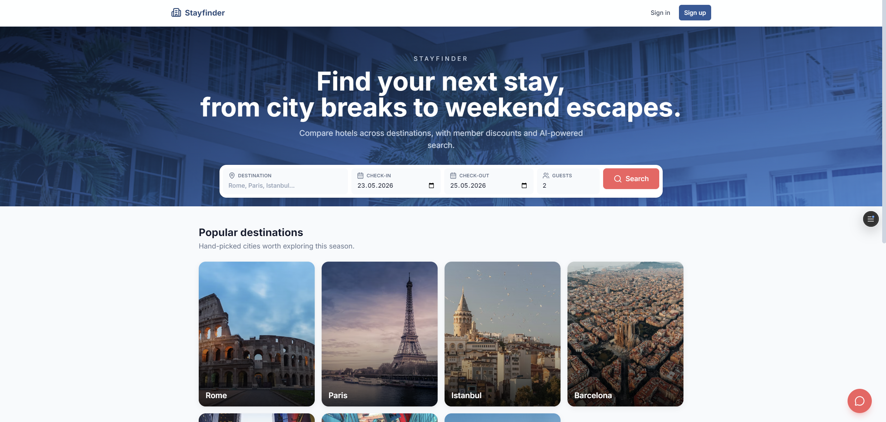
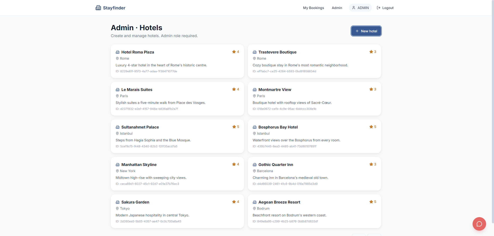
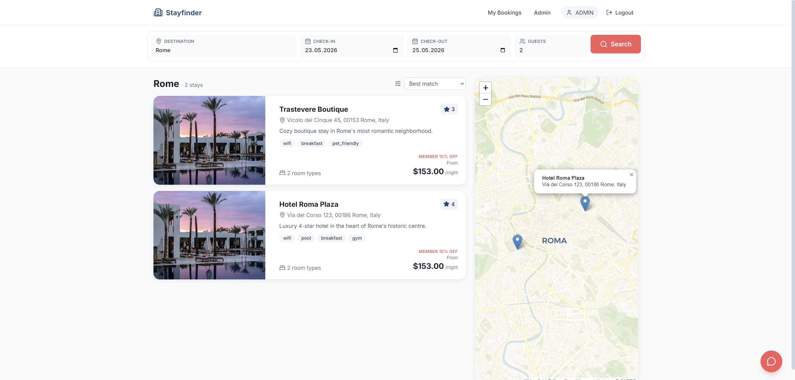
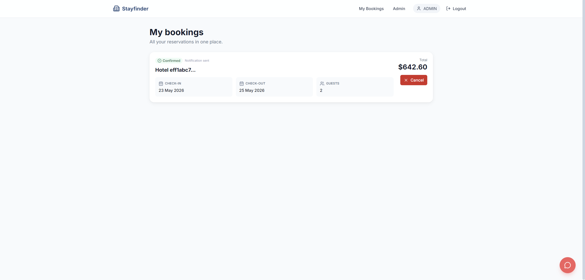
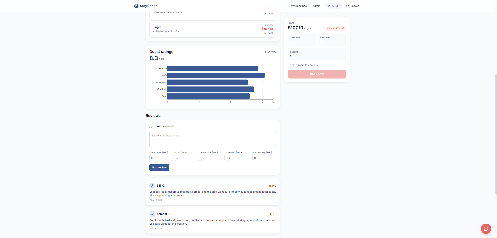
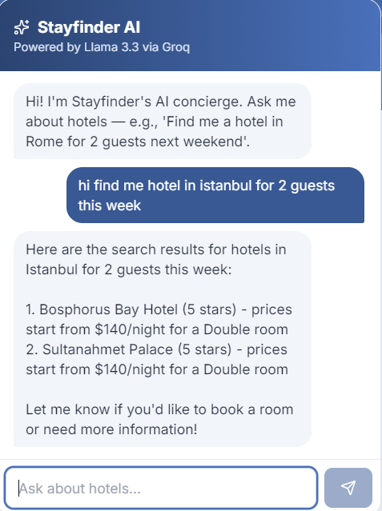
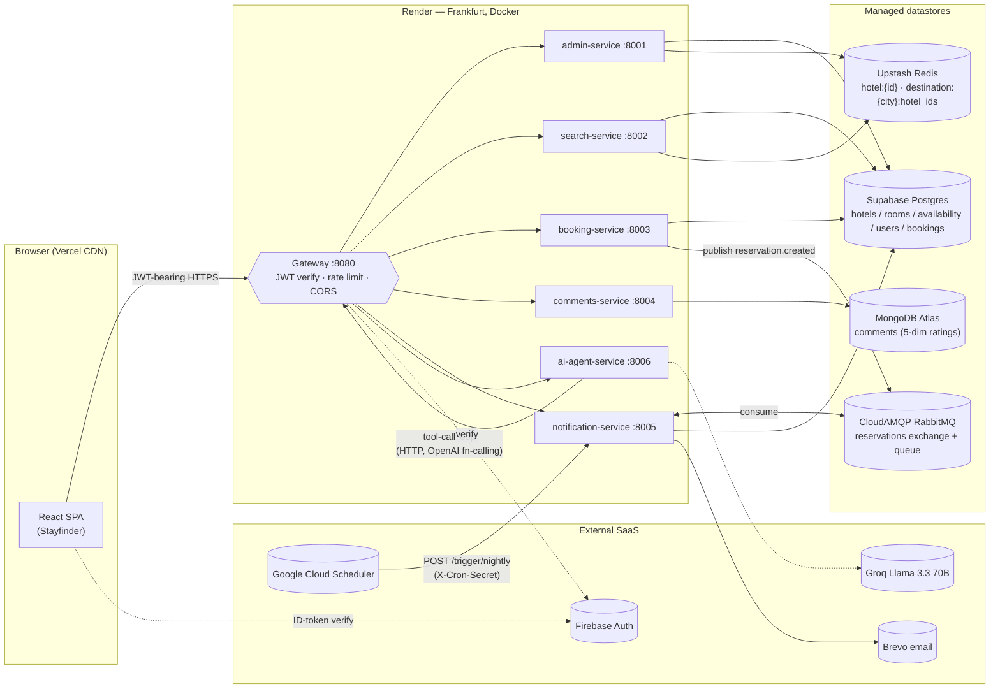
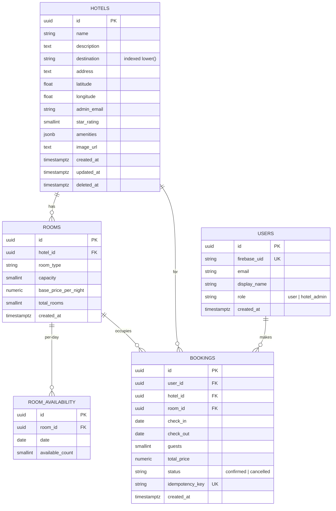
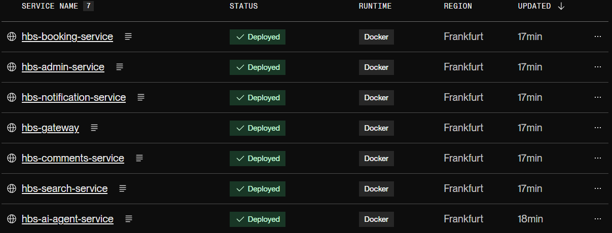
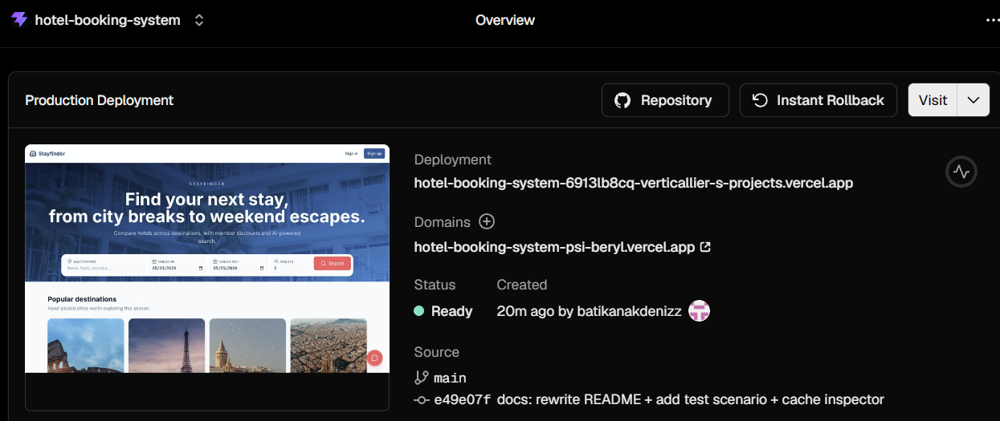

<div align="center">

# 🏨 Hotel Booking System

A production-grade, microservice-based hotel booking platform.

**SE 4458 — Software Architecture & Design of Modern Large Scale Systems · Final Project · Group 1**

[]()
[]()
[]()
[]()
[]()

[**🌐 Live App**](https://hotel-booking-system-psi-beryl.vercel.app) ·
[**⚙️ API Gateway**](https://hbs-gateway.onrender.com/health) ·
[**📦 Source**](https://github.com/batikanakdenizz/Hotel-Booking-System) ·
[**📺 Demo Video**](https://youtu.be/OdYu_x2EO3o)

</div>

> [!NOTE]
> The backend runs on **Render's free tier**. A GitHub Actions matrix pings
> every service every 10 minutes (auto-disables on 2026-05-29) so the
> first click during the grading window is instant. After that date the
> first request takes ~30 s to wake the containers.

<p align="center">
  
</p>

---

## 🌐 Live demo

| Layer | URL |
|---|---|
| Frontend (Vercel) | https://hotel-booking-system-psi-beryl.vercel.app |
| API Gateway (Render) | https://hbs-gateway.onrender.com |
| Source code | https://github.com/batikanakdenizz/Hotel-Booking-System |
| Demo video (≤ 5 min) | https://youtu.be/OdYu_x2EO3o |

**Try it:** open the live app, search for **Istanbul** with future
dates, click any hotel, and try the floating AI chat in the bottom-right
corner — ask it "find me a hotel in Rome on Jul 15 to Jul 18 for 2
guests".

---

## 📑 Table of contents

1. [About the project](#-about-the-project)
2. [Key features](#-key-features)
3. [Tech stack](#%EF%B8%8F-tech-stack)
4. [Architecture](#%EF%B8%8F-architecture)
5. [Data models](#-data-models)
6. [API surface](#-api-surface)
7. [Project structure](#-project-structure)
8. [Local development](#-local-development)
9. [Production deployment](#-production-deployment)
10. [Verification & testing scripts](#-verification--testing-scripts)
11. [Design decisions](#-design-decisions)
12. [Assumptions](#-assumptions)
13. [Issues encountered](#-issues-encountered)
14. [Demo video](#-demo-video)
15. [License](#-license)

---

## 📖 About the project

The brief: build a hotel booking platform like Hotels.com. The course
requirements (`docs/Guide/Final_Guideline.pdf`) call for a microservice
architecture deployed to the cloud, with each service exposed only
through a single API gateway. The system has to support hotel-admin
management, public search with map and member discount, transactional
booking, reviews with multi-dimensional ratings, scheduled background
work, and an AI agent that drives all those flows in natural language.

This implementation goes further than the brief in three places:

- **Production-grade reliability** — Postgres transactions with
  `SELECT FOR UPDATE`, durable RabbitMQ publish with exponential retries,
  cache-aside with admin-side invalidation, pooler-safe asyncpg, dual-key
  CORS, and warmup pings during the grading window.
- **Real AI agent, not a wrapper** — the chat widget hosts a tool-calling
  loop against Groq's Llama 3.3 70B that calls the platform's own
  REST API to search, book, and fetch reviews, with conversation memory
  per session.
- **Tooling that proves it works** — there are seven verification
  scripts in `scripts/` that exercise every external dependency,
  inspect the live Redis cache, prove the 15% discount applies, and
  smoke-test the deployed gateway end-to-end.

---

## ✨ Key features

Every feature listed below corresponds to a requirement in the final
guideline; the implementation file path is given so a reviewer can jump
straight to the code.

### 1. Hotel admin — authenticated CRUD over rooms & availability
- Add / update hotels, rooms, and per-date availability.
- Gated by Firebase JWT (gateway) **and** a Postgres `users.role = 'hotel_admin'`
  check (downstream); promoting a user is a single SQL `UPDATE`.
- Cache invalidation on every write so search readers see fresh data.
- Code: `services/admin-service/app/routers/`.

<p align="center">
  
</p>

### 2. Hotel search — destination + dates + guests, with map
- Searches only rooms whose `room_availability.available_count > 0`
  for every date in `[check_in, check_out)`.
- Destination input has an **autocomplete dropdown** with the seeded
  cities; accent / case / Turkish dotted-İ insensitive so
  *İstanbul* / *istanbul* / *İSTANBUL* all canonicalize to the same
  search.
- "Haritada göster" via **react-leaflet + CartoDB Voyager tiles**.
- Hotel-detail payloads are served from Upstash Redis (`hotel:{id}`,
  24 h TTL); availability is **never cached** so we never sell a sold
  room.
- Code: `services/search-service/app/routers/search.py`,
  `frontend/src/components/SearchBar.tsx`.

<p align="center">
  
</p>

### 3. Member-only 15% discount
- Search-service applies a runtime 0.85× multiplier when the request
  carries a verified Firebase token. Anonymous calls get full price.
- `discount_applied: true` flag drives the "Member 15% off" badge in
  the UI.
- Verified end-to-end by `scripts/verify_discount.py`
  (every room costs exactly 0.85× the anonymous price).
- Code: `services/search-service/app/services/pricing.py`.

### 4. Transactional booking
- Inside one async transaction:
  - `SELECT … FOR UPDATE` on every `room_availability` row in the
    date range.
  - Assert `available_count > 0`, decrement.
  - Insert the booking row (optional `idempotency_key`).
  - Commit.
- After the commit, the service publishes
  `reservation.created` to a durable RabbitMQ exchange with
  `delivery_mode=2` (persistent) and a 3-retry exponential backoff via
  `tenacity`.
- Code: `services/booking-service/app/services/booking.py`.

<p align="center">
  
</p>

### 5. Reviews + per-dimension rating distribution
- 5-dimensional ratings on a 1–10 scale per the PDF mockup:
  cleanliness, staff, amenities, comfort, eco-friendliness.
- A single MongoDB aggregation pipeline produces averages
  (`$group`) **and** the histogram (`$bucket`) per hotel — feeds the
  Recharts horizontal bar chart on the detail page.
- Code: `services/comments-service/app/repositories/comment.py`.

<p align="center">
  
</p>

### 6. Nightly low-occupancy alerts
- `notification-service` exposes `POST /trigger/nightly`, guarded by
  an `X-Cron-Secret` header.
- A scheduled Google Cloud Scheduler job hits it every night at
  02:00 Europe/Istanbul. The worker scans next-30-day availability,
  flags hotels under the 20% threshold, and emails their admin via
  Brevo.
- Code: `services/notification-service/app/workers/occupancy.py`.

### 7. RabbitMQ-driven booking notifications
- The consumer (`services/notification-service/app/workers/consumer.py`)
  pulls every `reservation.created` event, sends a confirmation email
  via Brevo, and acks only after the email succeeds (manual ack —
  at-least-once semantics).

### 8. AI agent chat
- Persistent floating widget powered by **Groq Llama 3.3 70B** via the
  OpenAI-compatible API.
- In-process tool registry exposes three tools:
  `search_hotels`, `book_hotel`, `get_hotel_comments`. The agent calls
  the gateway over HTTPS the same way the browser does, forwarding the
  signed-in user's bearer token so per-user bookings work.
- Per-session conversation memory; max 5 tool-iteration cap so a
  misbehaving LLM cannot hammer the API.
- Code: `services/ai-agent-service/app/`.

<p align="center">
  
</p>

### 9. Distributed cache (hotel details + destination index)
- `hotel:{uuid}` strings hold every static hotel field plus its rooms,
  24 h TTL.
- `destination:{lower_city}:hotel_ids` sets index the search-service's
  "all hotels in this city" lookup, 6 h TTL.
- Invalidation owned by `admin-service` on PATCH/DELETE.
- Verified live by `scripts/inspect_cache.py`
  (lists keys, TTLs, full payloads from Upstash).

---

## 🛠️ Tech stack

| Layer | Choice | Why |
|---|---|---|
| Backend language | **Python 3.12** | Mature async ecosystem; matches stated career goal |
| Web framework | **FastAPI 0.115** | First-class async, Pydantic v2 validation, OpenAPI for free |
| ORM | **SQLAlchemy 2 (async) + asyncpg** | Battle-tested, supports the patterns the Supabase pooler requires |
| Migrations | **Alembic** | Owned by `admin-service`, autogen targets the shared models |
| Postgres | **Supabase** (Frankfurt) | Managed Postgres + Auth-free tier; uses Supavisor transaction pooler |
| Document store | **MongoDB Atlas** (M0) | Fits the soft, denormalised comment schema |
| Cache | **Upstash Redis** | Serverless Redis; usage-based free tier |
| Queue | **CloudAMQP RabbitMQ** | Durable exchanges + persistent messages on the free "Little Lemur" plan |
| Auth (IAM) | **Firebase Authentication** | Web SDK + Admin SDK; satisfies the "external IAM" guideline rule |
| LLM | **Groq Llama 3.3 70B** | Sub-second latency, OpenAI-compatible API, generous free tier |
| Email | **Brevo** | 300 emails/day free tier; verifies a single sender (no domain needed) so the demo delivers to any recipient |
| Frontend framework | **React 19 + Vite + TypeScript** | Fastest dev loop, content-hash chunking, SPA-friendly |
| UI styling | **Tailwind CSS 3.4** | Hand-rolled brand palette + Inter font |
| Data fetching | **TanStack Query 5** | Smart cache, retries, query invalidation hooks |
| Forms | **react-hook-form + zod** | Type-safe validation with a single schema |
| Map | **react-leaflet + CartoDB Voyager** | Voyager has friendlier rate-limits than raw OSM for production |
| Charts | **Recharts 3** | Hand-tuned horizontal-bar chart for the 5-dim rating |
| Toasts | **Sonner** | Lightweight, dark-mode aware |
| Animations | **Framer Motion** | Used by the AI chat widget for the floating-panel transition |
| Backend hosting | **Render** (7 Docker services) | One Blueprint, free tier, Frankfurt region |
| Frontend hosting | **Vercel** (Vite SPA + CDN) | Auto-deploys on every push to `main` |
| Scheduling | **Google Cloud Scheduler** + GitHub Actions matrix | Cloud Scheduler for nightly cron; GH Actions for warmup ping |
| CI | **GitHub Actions** | `.github/workflows/warmup.yml` keeps services warm during the demo window |

---

## 🏗️ Architecture



A deeper write-up (sequence diagrams, decision log, cache key
invariants) lives in [`docs/ARCHITECTURE.md`](docs/ARCHITECTURE.md).

<!-- TODO: optional photo of an actual whiteboard sketch or a higher-res
     PNG export of the diagram. docs/screenshots/08-architecture.png -->

---

## 🗂️ Data models

### Postgres — relational core



### MongoDB — `comments` collection

```jsonc
{
  "_id": ObjectId("..."),
  "hotel_id": "439b7445-…",          // logical FK to Postgres hotels.id
  "user_id": "firebase-uid",
  "user_display_name": "Elif K.",
  "text": "Spotless room, generous breakfast …",
  "ratings": {
    "cleanliness": 10,
    "staff": 10,
    "amenities": 9,
    "comfort": 9,
    "eco_friendliness": 7
  },
  "overall_rating": 9.0,             // denormalised average
  "created_at": ISODate("…"),
  "deleted_at": null                 // soft delete
}
```

---

## 🔌 API surface

Every endpoint is mounted under `/api/v1/`. The gateway preserves the
prefix when proxying, so the downstream routers register the same path.

| Method | Path | Auth | Purpose |
|---|---|---|---|
| `GET` | `/api/v1/search` | optional | Search hotels by destination + dates + guests |
| `GET` | `/api/v1/search/hotels/{id}` | optional | Single hotel detail (cache-aside) |
| `POST` | `/api/v1/admin/hotels` | admin | Create a hotel |
| `GET` | `/api/v1/admin/hotels` | admin | Paginated admin hotel list |
| `PATCH` | `/api/v1/admin/hotels/{id}` | admin | Update a hotel (invalidates cache) |
| `DELETE` | `/api/v1/admin/hotels/{id}` | admin | Soft delete + cache invalidation |
| `POST` | `/api/v1/admin/hotels/{id}/rooms` | admin | Add a room type |
| `PUT` | `/api/v1/admin/rooms/{id}/availability` | admin | Bulk-upsert availability for a date range |
| `POST` | `/api/v1/bookings` | required | Create a transactional booking |
| `GET` | `/api/v1/bookings` | required | Logged-in user's bookings |
| `DELETE` | `/api/v1/bookings/{id}` | required | Cancel a booking |
| `GET` | `/api/v1/comments/hotels/{id}` | optional | Paginated reviews for a hotel |
| `GET` | `/api/v1/comments/hotels/{id}/distribution` | optional | 5-dim averages + histogram |
| `POST` | `/api/v1/comments` | required | Post a 5-dim review |
| `DELETE` | `/api/v1/comments/{id}` | required | Soft-delete own review |
| `POST` | `/api/v1/agent/chat` | optional | AI chat (forwards token for tool auth) |
| `GET` | `/api/v1/agent/debug/config` | optional | Echo effective agent config |
| `GET` | `/api/v1/agent/debug/search` | optional | Bypass-LLM tool sanity check |
| `POST` | `/trigger/nightly` | X-Cron-Secret | Run the nightly low-availability scan |
| `GET` | `/health` | optional | Liveness probe (every service exposes this) |

Pagination uses `?page=<n>&limit=<m>` with a hard `limit ≤ 100`, and
responses for listing endpoints follow
`{ items: T[], page: int, limit: int, total: int }`.

---

## 📁 Project structure

```
Hotel-Booking-System/
├── README.md
├── .env.example                ← every env var documented here
├── .gitignore
├── docs/
│   ├── ARCHITECTURE.md         ← sequence diagrams, decision log
│   ├── DEPLOY.md               ← step-by-step Render + Vercel
│   ├── SCHEDULING.md           ← Cloud Scheduler + warmup setup
│   └── Plan/                   ← original implementation plan (TR + EN)
├── infrastructure/
│   ├── docker-compose.yml      ← local 7-service stack (optional)
│   └── render.yaml             ← one-click Render Blueprint
├── .github/
│   └── workflows/
│       └── warmup.yml          ← 10-min ping matrix, auto-disables 2026-05-29
├── frontend/                   ← React 19 + Vite + TS SPA
│   ├── vercel.json             ← SPA rewrite for React Router
│   ├── tailwind.config.js
│   ├── src/
│   │   ├── App.tsx             ← router + providers
│   │   ├── pages/              ← Home, Search, HotelDetail, Login, SignUp,
│   │   │                         MyBookings, AdminHotels
│   │   ├── components/         ← HotelCard, HotelMap (Leaflet),
│   │   │                         RatingChart (Recharts), ChatWidget
│   │   ├── api/                ← typed TanStack Query hooks
│   │   ├── hooks/              ← AuthProvider (Firebase)
│   │   ├── lib/                ← axios client, firebase init, utils
│   │   └── types/              ← TS interfaces mirroring Pydantic schemas
│   └── package.json
├── services/
│   ├── shared/                 ← installable editable package
│   │   └── shared/
│   │       ├── auth/           ← firebase.py + deps.py (lazy SQLAlchemy)
│   │       ├── clients/        ← postgres, mongo, redis, rabbitmq
│   │       ├── models/         ← SQLAlchemy 2 ORM (single source of truth)
│   │       ├── schemas/        ← Pydantic v2 DTOs
│   │       └── config.py, logging.py
│   ├── gateway/                ← single public surface
│   ├── admin-service/          ← also home to Alembic migrations
│   ├── search-service/
│   ├── booking-service/
│   ├── comments-service/
│   ├── notification-service/
│   └── ai-agent-service/
└── scripts/
    ├── verify_external_services.py   ← Postgres / Mongo / Redis / RabbitMQ / Firebase / Groq / Brevo smoke checks
    ├── seed_demo_data.py             ← seed Postgres with 10 hotels + 90-day availability
    ├── seed_demo_comments.py         ← seed Mongo with 4-6 reviews per hotel
    ├── promote_admin.py              ← UPDATE users SET role='hotel_admin'
    ├── smoke_test_gateway.py         ← unauthenticated golden-path e2e check
    ├── verify_discount.py            ← prove the 15% member discount is exact
    ├── inspect_cache.py              ← dump live Upstash Redis keys + TTLs
    └── run_all_services.ps1          ← Windows launcher for 7 dev services
```

---

## 💻 Local development

> Tested with Python 3.12 / 3.13, Node 20+, PowerShell 5.1 on Windows 11.
> The same commands work on macOS/Linux with minor path tweaks.

### 1. Clone and configure

```bash
git clone https://github.com/batikanakdenizz/Hotel-Booking-System.git
cd Hotel-Booking-System
cp .env.example .env
# Fill in the real values (Supabase URL, Firebase service account JSON, etc.)
```

Every required environment variable is documented in
[`.env.example`](.env.example).

### 2. Backend setup

```powershell
python -m venv .venv
.venv\Scripts\activate
pip install -r scripts/requirements.txt
# Install each service's deps (shared is editable, so it picks up changes)
pip install -r services/admin-service/requirements.txt
pip install -r services/search-service/requirements.txt
# ... or use `for /R %f in (requirements.txt) do pip install -r %f`
```

Apply the database schema:

```powershell
$env:POSTGRES_URL = (Get-Content .env | Where-Object { $_ -like "POSTGRES_URL=*" }) -replace "^POSTGRES_URL=", ""
cd services/admin-service
alembic upgrade head
cd ../..
python scripts/seed_demo_data.py
python scripts/seed_demo_comments.py
```

### 3. Run all services

```powershell
.\scripts\run_all_services.ps1
```

This opens seven PowerShell windows, one per service. Tail the logs of
any single window to see structured JSON output from `structlog`.

### 4. Run the frontend

```bash
cd frontend
npm install
npm run dev    # http://localhost:5173
```

The Vite dev server proxies `/api/*` to the local gateway, so the
frontend speaks to your local backend stack — even without
`VITE_API_GATEWAY_URL` set.

### 5. Smoke-check everything

```bash
python scripts/smoke_test_gateway.py
```

Expected output (each step under 1 s after warmup):

```
[PASS] gateway /health
[PASS] GET /api/v1/search?destination=Rome -- total=2
[PASS] GET /api/v1/search/hotels/{id}
[PASS] GET /api/v1/comments/hotels/{id}
[PASS] GET /api/v1/comments/hotels/{id}/distribution
[PASS] POST /api/v1/agent/chat -- LLM returned hotel list
```

---

## 🚀 Production deployment

The detailed step-by-step is in [`docs/DEPLOY.md`](docs/DEPLOY.md).
High-level:

| Step | Where | Time |
|---|---|---|
| Push code to GitHub | local | 1 min |
| Render Blueprint → reads `infrastructure/render.yaml`, creates 7 services | Render dashboard | 5 min |
| Set per-service secrets (Postgres / Mongo / Redis / RabbitMQ / Groq / Brevo / Firebase) | Render env tab | 10 min |
| Verify `/health` returns 200 | terminal | 1 min |
| Vercel project import, root = `frontend/` | Vercel dashboard | 3 min |
| Set `VITE_*` env vars (Firebase web SDK + gateway URL) | Vercel env tab | 5 min |
| Add Vercel URL to `CORS_ALLOWED_ORIGINS` on the gateway | Render env tab | 2 min |
| Add Vercel host to Firebase Authorized Domains | Firebase console | 2 min |
| Create the Cloud Scheduler nightly job | GCP console | 5 min |

<p align="center">
  
</p>

<p align="center">
  
</p>

---

## 🧪 Verification & testing scripts

Every claim in this README has a matching script in `scripts/` that
proves it on the live system.

| Script | Proves |
|---|---|
| `verify_external_services.py` | Every external dep (Postgres / Mongo / Redis / RabbitMQ / Firebase / Groq / Brevo) is reachable with the configured credentials. |
| `smoke_test_gateway.py` | Unauthenticated golden path (health, search, hotel detail, comments, distribution, agent chat) all return 200 with valid bodies. |
| `verify_discount.py` | Mints a Firebase ID token, calls `/api/v1/search` anonymously and with the token, and asserts every room costs **exactly** 0.85× the anonymous price. |
| `inspect_cache.py` | Walks Upstash Redis, lists every `hotel:*` and `destination:*` key with TTL + payload preview, then triggers a search and re-walks to prove the new key appears. |
| `seed_demo_data.py` | Seeds Postgres with 10 hotels across 7 cities + 90 days of availability + 5 sample bookings. |
| `seed_demo_comments.py` | Idempotently inserts 4–6 reviews per hotel into MongoDB (46 docs total). |
| `promote_admin.py` | Flips a user's Postgres `role` to `hotel_admin`. |

### Sample outputs

`scripts/verify_discount.py` (excerpt):

```
Hotel                          Room                       Anon       Auth      Ratio   Auth flag
----------------------------------------------------------------------------------------------------
Bosphorus Bay Hotel            Double                   $140.00   $119.00     0.8500    True  [OK]
Bosphorus Bay Hotel            Suite                    $294.00   $249.90     0.8500    True  [OK]
Sultanahmet Palace             Suite                    $294.00   $249.90     0.8500    True  [OK]
Sultanahmet Palace             Double                   $140.00   $119.00     0.8500    True  [OK]

[verify-discount] PASS -- discount is exactly 15% for every room
```

`scripts/inspect_cache.py` (excerpt):

```
=== Hotel-detail entries (pattern=hotel:*) ===
  hotel:439b7445-…  ttl=17.9h  preview={"name": "Bosphorus Bay Hotel", …}
  hotel:5cef9cf5-…  ttl=17.9h  preview={"name": "Sultanahmet Palace", …}
  …
=== Destination index sets (pattern=destination:*) ===
  destination:istanbul:hotel_ids  ttl=5.8h  members=[…, …]
```

---

## 🧭 Design decisions

A condensed log of the calls that shaped the system. The long-form
versions are in [`docs/ARCHITECTURE.md`](docs/ARCHITECTURE.md).

1. **Cache hotel details, not search results.** Caching search would
   force aggressive invalidation on every booking; caching the static
   per-hotel fields gives near-instant detail pages without staleness.
2. **Booking commits first, then publishes.** We accept "Postgres has the
   booking, RabbitMQ doesn't" as the failure mode — the user still sees
   the booking on their page, and the durable queue + retry loop makes
   this vanishingly rare.
3. **Identity (Firebase) separated from authorization (Postgres).** The
   gateway verifies the JWT once; downstream services trust the
   forwarded `X-User-Id`. Role checks read from Postgres `users.role`
   so promoting a user is a single SQL UPDATE.
4. **AI agent uses an in-process tool registry** instead of MCP-over-
   subprocess. Simpler deploy, same behaviour from the LLM's
   perspective.
5. **Pooler-safe asyncpg.** Supabase's transaction pooler reuses
   backend sessions, so prepared statement names are randomised with
   UUIDs (`prepared_statement_name_func`) and the cache is disabled
   (`statement_cache_size=0`). Without this we'd see
   `DuplicatePreparedStatementError` under load.
6. **`Accept-Encoding: identity` on every inter-service hop.**
   Cloudflare in front of Render aggressively brotli-compresses
   responses, and httpx without the optional `brotli` package can't
   decode them. Forcing identity on upstream calls keeps the proxy
   and tool calls reliable.

---

## 📐 Assumptions

Explicitly documented so a reviewer can challenge them:

- **Capacity is room-type-based**, not specific-room-based. A single
  `room_availability` row tracks how many physical rooms of a type
  are free on a date.
- **Cancelling a booking does not roll back availability.** This is a
  deliberate cut-for-time; production would do the opposite under the
  same lock.
- **"Next month"** in the nightly check is interpreted as the next
  30 days from UTC midnight.
- **Ratings use a 1–10 scale** (matching the PDF mockup), not 1–5
  stars. Averages stay meaningful either way.
- **AI agent state is in-memory.** Restarting `ai-agent-service` loses
  per-session chat history. Acceptable for a demo; would swap for
  Redis sessions in production.
- **Email is sent from a Brevo-verified single sender** (a personal
  Gmail/Hotmail) so we can deliver to any recipient on the 300/day
  free tier without owning a domain. Production with higher volume
  would benefit from a verified custom domain (better deliverability,
  professional From: address).
- **Render free-tier services sleep after 15 min** of idle. The
  warmup GitHub Action runs only until 2026-05-29 so the project
  doesn't burn free-tier instance hours indefinitely.

---

## 🩹 Issues encountered

The full audit log (every bug + its commit) lives in
[`docs/ARCHITECTURE.md`](docs/ARCHITECTURE.md). The highlights:

| Symptom | Root cause | Resolution |
|---|---|---|
| `DuplicatePreparedStatementError` from asyncpg | Supabase transaction pooler reuses backend sessions | `prepared_statement_name_func` with UUIDs + `statement_cache_size=0` |
| `ModuleNotFoundError: sqlalchemy` in mongo-only service | Eager re-exports in `shared/__init__.py`s | Slimmed package inits; moved DB imports into function scope |
| `UnicodeDecodeError: byte 0x82` in AI agent | Cloudflare brotli-compressed inter-service response, httpx couldn't decode | `Accept-Encoding: identity` on tool & proxy requests |
| "undefined stays" in search results UI | Stale Vercel CDN cache + Render cold-start 502 cascade | Hard refresh + warmup matrix + `Accept-Encoding` fix |
| Fragmented map tiles | Leaflet CSS dropped because `@import` came after `@tailwind` directives | `import 'leaflet/dist/leaflet.css'` in `main.tsx` instead |
| Render Blueprint `fromService.host` returned bare service names | Render's free tier resolves this differently than docs imply | Hardcoded `*.onrender.com` URLs in `render.yaml` + Pydantic `field_validator` that auto-suffixes `.onrender.com` |
| Booking-confirmation emails silently rejected for non-account-owner recipients | Resend's free sandbox sender (`onboarding@resend.dev`) only delivers to the account's verified email | Migrated `EmailClient` to Brevo's transactional API; verifies a single sender email (no custom domain needed) and delivers to any recipient on the 300/day free tier |
| `Istanbul` / `İstanbul` / `istanbul` returned different results | Free text input let the user submit a non-canonical destination | Autocomplete dropdown in `SearchBar` with NFD-normalised, dotted-I tolerant fuzzy match; canonical city name always submitted |

Each of these is fixed in the production deployment as of commit
[`3824e87`](https://github.com/batikanakdenizz/Hotel-Booking-System/commit/3824e87).

---

## 📺 Demo video

**▶️ Watch:** https://youtu.be/OdYu_x2EO3o (≤ 5 minutes)

The walkthrough covers:

1. Live URL + architecture overview (30 s)
2. Search → results + map → hotel detail (60 s)
3. Sign-up → booking → My Bookings → email confirmation via Brevo (60 s)
4. Comments + 5-dimension Recharts distribution (60 s)
5. AI chat: natural-language search + book against the Groq Llama 3.3
   tool-calling loop (60 s)
6. Admin panel + brief peek at Render + Cloud Scheduler (30 s)

> The shot-by-shot recording script + a 29-test pre-recording rehearsal
> live in [`TestScenerio.md`](TestScenerio.md) and
> [`demovideooutline.md`](demovideooutline.md).

---

## 🙌 Acknowledgements

- **Cloudflare / Render** for the free hosting tier that makes
  student projects like this deployable.
- **Supabase, MongoDB Atlas, Upstash, CloudAMQP, Firebase, Groq,
  Brevo** for the no-credit-card free tiers.
- **CartoDB Voyager** for production-grade map tiles after the OSM
  tile server started throttling us.
- The teaching staff of **SE 4458 (Yaşar University)** for the
  project brief.

---

## 📜 License

[MIT](LICENSE) — feel free to study, fork, or build on top of this
project.
