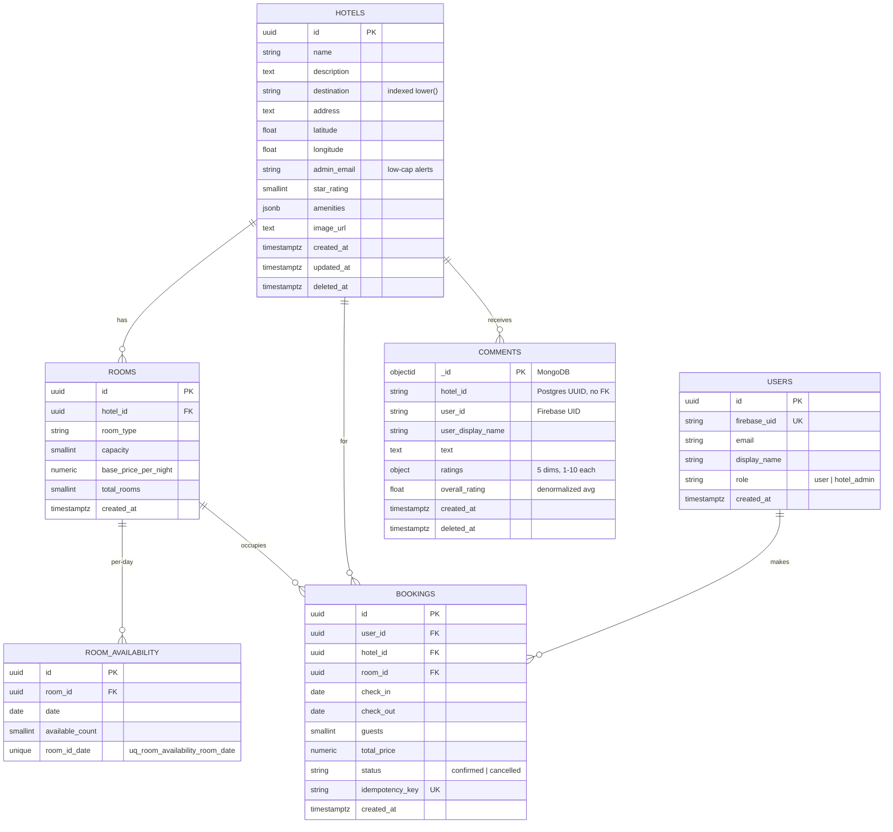

# Architecture

Companion document to the README. Focused on **how** the system is shaped and
**why** specific choices were made.

---

## Component diagram

```
                                Browser (React SPA)
                                       │
                                       │ HTTPS + Firebase ID token
                                       ▼
                          ┌─────────────────────────┐
                          │       Gateway (8080)    │
                          │  · JWT verify           │
                          │  · Rate limit (60/min)  │
                          │  · CORS                 │
                          │  · httpx reverse proxy  │
                          └─────────────────────────┘
                          │      │      │      │      │
              ┌───────────┘      │      │      │      └─────────────┐
              ▼                  ▼      ▼      ▼                    ▼
   ┌──────────────┐  ┌──────────────┐ ┌──────────────┐ ┌──────────────┐ ┌──────────────┐
   │ admin (8001) │  │ search (8002)│ │booking (8003)│ │comments(8004)│ │ai-agent(8006)│
   └──────────────┘  └──────────────┘ └──────────────┘ └──────────────┘ └──────────────┘
        │   │              │   │            │   │            │              │
        ▼   ▼              ▼   ▼            ▼   ▼            ▼              ▼
   ┌────────┐ ┌────────┐  ┌──────┐    ┌──────────┐  ┌──────────┐    ┌───────┐
   │Postgres│ │ Redis  │  │Redis │    │ RabbitMQ │  │ MongoDB  │    │ Groq  │
   │(hotels,│ │(hotel:*│  │(read)│    │(durable, │  │  Atlas   │    │ LLM   │
   │ rooms, │ │ dest:*)│  │      │    │persistent│  │(comments)│    │       │
   │bookings│ │        │  │      │    │+ retry)  │  │          │    │       │
   │ users) │ │        │  │      │    │          │  │          │    │       │
   └────────┘ └────────┘  └──────┘    └────┬─────┘  └──────────┘    └───────┘
                                            │
                                            ▼
                                 ┌─────────────────────────┐
                                 │ notification (8005)     │
                                 │ · RabbitMQ consumer      │
                                 │ · Brevo email           │
                                 │ · POST /trigger/nightly  │
                                 │   (Cloud Scheduler)      │
                                 └─────────────────────────┘
```

`gateway` is the only public-facing service in production. Inter-service
calls go over `https://*.onrender.com` (no private networking on Render
free tier).

---

## ER diagram



`COMMENTS` lives in MongoDB; `hotel_id` is a logical reference (no FK) to
the Postgres `HOTELS.id`. Soft delete only — `deleted_at IS NULL` filters
in every read query.

---

## Design highlights

### 1. Cache **hotel details**, not search results

The guideline explicitly mentions "hotel details" as the cache target.
Caching search results would force aggressive invalidation on every booking
or availability edit. Hotel-detail data (name, description, address,
amenities, lat/lng, star_rating) changes rarely, so a 24 h TTL with
admin-side invalidation is a strict improvement over uncached.

- Key: `hotel:{uuid}` → JSON of hotel static fields
- TTL: 24 h (`HOTEL_DETAIL_TTL_SECONDS=86400`)
- Invalidated by: `admin-service` on PATCH/DELETE
- Secondary index: `destination:{name}:hotel_ids` → set of UUIDs, 6 h TTL

Availability and booking counts are **never** cached — they are queried
fresh on every search so we never sell a room that's no longer free.

### 2. Booking + queue: at-least-once with dual-write mitigation

The classic dual-write problem: how do we make sure that "Postgres has the
booking" and "RabbitMQ has the notification event" stay consistent?

Our chosen trade-off (`services/booking-service/app/services/booking.py`):

1. Open async transaction.
2. `SELECT FOR UPDATE` the `room_availability` rows for the date range.
3. Assert each `available_count > 0`, then decrement.
4. Insert the `bookings` row (with optional `idempotency_key`).
5. COMMIT.
6. After commit, publish a `reservation.created` event with
   - `delivery_mode=2` (persistent)
   - durable exchange + queue (survives a broker restart)
   - 3-retry exponential backoff via `tenacity`

If step 6 fails after all retries, the booking is still confirmed in
Postgres but no email goes out. That's **acceptable for this domain** —
the user can still see the booking in `/my-bookings`. Alternatives
considered (outbox pattern, transactional broker) are stronger but
require infrastructure we don't have on the free tier.

The consumer (`notification-service`) acks only after the email succeeds,
so broker-side it's effectively at-least-once.

### 3. Auth at the gateway, role check downstream

- Browser → Firebase Web SDK → ID token
- Gateway → `verify_firebase_token` (offline, against cached Google keys)
- Gateway → forwards `X-User-Id` (Firebase UID) to downstream
- Downstream service → trusts `X-User-Id`, hits Postgres `users` table
  for role check (`require_admin`)

This avoids re-verifying the JWT in every service and keeps the
"identity" (Firebase) cleanly separate from "authorization" (Postgres
role). Promoting a user to admin is a single SQL UPDATE — no Firebase
custom claims required.

### 4. 15% discount via optional auth

`/api/v1/search` is auth-optional. When the gateway sees a valid token,
it forwards `X-User-Id`; search-service then applies a 15% multiplier to
`price_per_night` and flags `discount_applied=true` on each room.
Anonymous callers get full price.

### 5. AI agent via in-process tool registry

The original Plan called for an MCP-style subprocess. We dropped to an
in-process tool registry (`services/ai-agent-service/app/tools/`) because
the subprocess model would have doubled deploy complexity without changing
the demo behavior. The LLM still uses OpenAI-style function-calling JSON;
the dispatcher just calls Python functions instead of spawning
subprocesses.

Tools call the gateway over HTTPS (same as the browser), forwarding the
user's bearer token so the 15% discount and per-user bookings work.

### 6. 5-dimensional ratings

The PDF mockup shows five service dimensions
(cleanliness / staff / amenities / comfort / eco-friendliness), each on
a 1-10 scale. The Mongo aggregation pipeline runs `$group` for the five
averages plus a `$bucket` histogram in a single Mongo round-trip per hotel.

---

## Pagination & versioning

- Every REST endpoint is mounted under `/api/v1/`. The gateway preserves
  the prefix when proxying, so downstream routers register the same path.
- Listing endpoints accept `?page=1&limit=20` via
  `shared.schemas.PaginationParams`, with sensible defaults and a hard
  `limit ≤ 100` cap. Responses wrap items in
  `shared.schemas.PaginatedResponse[T]` = `{items, page, limit, total}`.

---

## Assumptions

- Booking is room-type-based, not specific-room-based: a single
  `room_availability` row tracks how many physical rooms of a given type
  are free on a given date. Total_rooms on `rooms` is the upper bound.
- Cancelling a booking does NOT yet roll back `room_availability`. This is
  a deliberate cut-for-time — the demo cancel only marks `status='cancelled'`.
  Production would need a compensating UPDATE under the same lock.
- The 20% threshold for the nightly low-capacity email is configurable
  (`LOW_AVAILABILITY_THRESHOLD`, default 0.20).
- "Next month" in the nightly check = the next 30 days from "today" (UTC).
- Comments use a 1-10 rating scale matching the PDF mockup, not the
  conventional 1-5 stars; the UI surfaces the same averages either way.
- AI agent state is in-memory only (`services/ai-agent-service/app/session.py`).
  Restarting the service loses chat history. Acceptable for a demo; would
  swap for Redis sessions in production.

---

## Issues encountered (decision log)

- **Supabase pooler + asyncpg prepared-statement collisions** → fixed with
  `prepared_statement_name_func` (UUID names) + `statement_cache_size=0` in
  `services/shared/shared/clients/postgres.py`.
- **Render Blueprint `fromService.host` returned bare service names** not
  FQDNs. Worked around by hardcoding `https://<name>.onrender.com` in
  `infrastructure/render.yaml`, plus a defensive Pydantic `field_validator`
  on every inter-service URL so an operator typo cannot reach httpx.
- **Eager `__init__.py` re-exports forced SQLAlchemy onto every importer**.
  Slimmed `shared.auth/__init__.py` and `shared.clients/__init__.py` so a
  service that only needs Mongo doesn't drag in postgres deps. SQLAlchemy
  imports inside `shared.auth.deps` were moved to function scope.
- **Cold-start UX on Render free tier**. Mitigated with a GitHub Actions
  matrix that hits every service's `/health` every 10 min during the demo
  window (see `docs/SCHEDULING.md`).
- **Leaflet tile grid fragmenting** when the map mounts inside a sticky
  sidebar. Fixed with a `useEffect` that calls `map.invalidateSize()` on
  mount and on every container resize.

---

## Deployment

| Layer | Provider | Notes |
|---|---|---|
| 7 backend services | Render (Docker) | One Blueprint, `infrastructure/render.yaml` |
| Frontend | Vercel (Vite + CDN) | Auto-deploys on `main` push |
| Postgres | Supabase (Frankfurt) | Transaction pooler on port 6543 |
| MongoDB | MongoDB Atlas (M0 free) | Shared cluster |
| Redis | Upstash | Pay-per-request free tier |
| RabbitMQ | CloudAMQP | "Little Lemur" free plan |
| Email | Brevo (transactional) | Verified single-sender Gmail/Hotmail, 300/day free |
| Auth | Firebase | Web SDK + Admin SDK |
| Scheduler | Google Cloud Scheduler | Nightly `POST /trigger/nightly` |
| Warmup | GitHub Actions | 10-min ping matrix, auto-disables 2026-05-29 |

Full step-by-step: [`docs/DEPLOY.md`](DEPLOY.md) + [`docs/SCHEDULING.md`](SCHEDULING.md).
